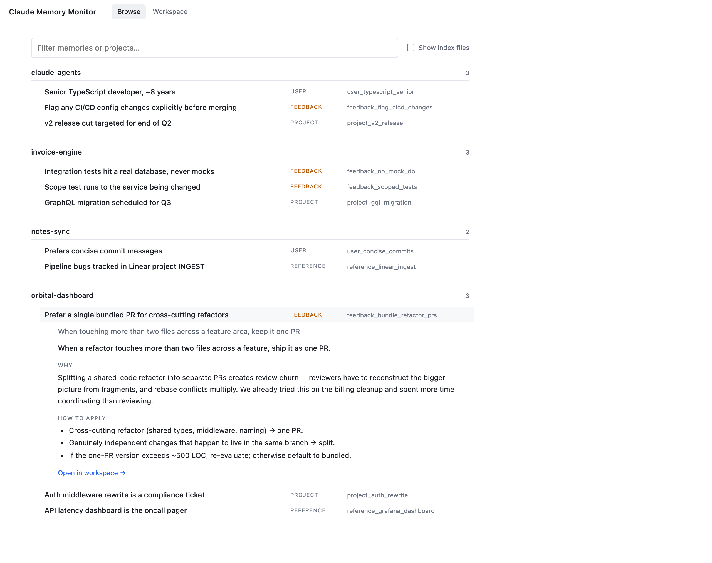
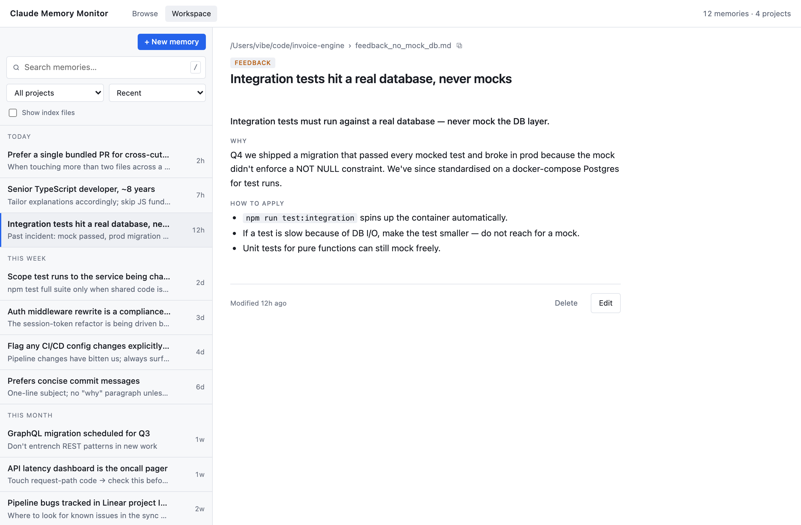

# memory-monitor

Claude Code builds up memory as you work — notes about your preferences, project quirks, and lessons from past sessions. Those files quietly pile up across every repo you use, and you rarely see them. **memory-monitor** opens everything it's remembered in one place so you can read through, edit, or tidy up.

Tiny local app. No account. Runs on your machine, nothing leaves it.

<p>
  
  
</p>

## Install and run

```bash
git clone https://github.com/JKershaw/memory-monitor.git
cd memory-monitor
npm start
```

The server prints a local URL and waits. Press **Enter** to open it in your browser.

No `npm install` needed — there are no runtime dependencies. (Install only kicks in if you want to run the test suite; see below.)

It binds to `127.0.0.1` only, checks the `Host` header, and requires `application/json` on state-changing requests. There's no auth — it's designed to run on your own machine, nothing else.

## Two views

- **Browse** (`/`) — read-only overview grouped by project. Click a row to slide open its details inline; click "Open in workspace" to jump into the editor.
- **Workspace** (`/dashboard`) — list + editor pane. Search, filter by project, create, edit, delete.

## Keyboard shortcuts

**Both views**

| Key | Action |
| --- | ------ |
| `/` | focus search |
| `j` / `k` | move through the list |
| `Enter` / `Space` | activate the focused row |
| `Esc` | close drawer / deselect / blur search |

**Browse only**

| Key | Action |
| --- | ------ |
| `o` | open the focused row in Workspace |

**Workspace only**

| Key | Action |
| --- | ------ |
| `e` | edit the selected memory |
| `Cmd/Ctrl+S` | save (while editing) |
| `Cmd/Ctrl+K` | focus search |

## Memory layout

Memories live under:

```
~/.claude/projects/
  -Users-you-code-some-project/
    memory/
      MEMORY.md              (per-project index, optional)
      feedback_xxx.md
      user_yyy.md
      ...
```

Each file is Markdown with YAML-style frontmatter:

```
---
name: Short title shown in the list
description: One-line summary used for relevance
type: user | feedback | project | reference
---

Body content.
```

The app parses that structure; feedback memories with `**Why:**` / `**How to apply:**` sections get rendered with labelled callouts.

## Development

```bash
npm test              # all three tiers
npm run test:unit     # pure helpers       (~100ms)
npm run test:integration   # HTTP routes, security gates  (~3s)
npm run test:e2e      # Playwright, Chromium only  (~4s)
npm run screenshots   # regenerate docs/screenshots/ against fake fixtures
```

The server is a single file with no runtime dependencies (`server.js`). The Browse and Workspace pages are embedded as template literals inside it. Playwright is the only dev dependency.

## Contributing

No plans to accept PRs, but GitHub issues are welcome if something's broken.
